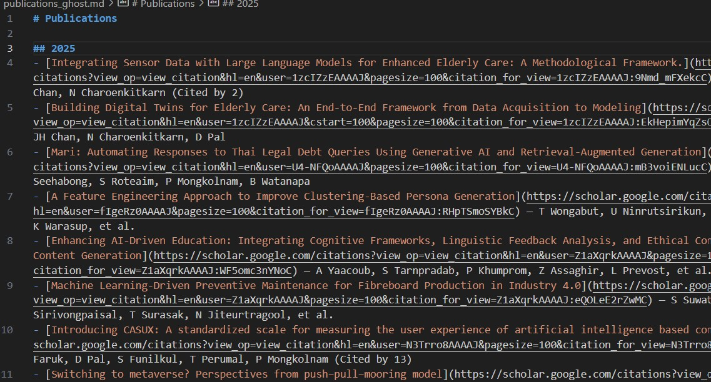

# Project Update

For simplicity, I came up with a different approach of web scraping from Google Scholar by using SerpAPI. I only called the API once and save it as markdown which the texts will then be uploaded to the Publication Page. Using markdown in the Ghost website builder allows future editors to add in publications with ease.

