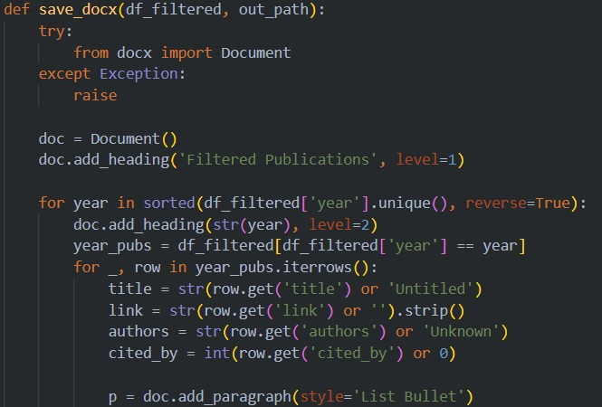

# IC2 Website Update
One of the students in IC2 (Kaung Myat Khaw) sent me the source code of the web scraping, together with all the author's URLs. I stumbled upon a tool called Serp API, which is designed to web scrape publications from Google Scholar based on the author's unique ID.

## Data Filtering
I utilize Python to aggregate all publications, subsequently cleaning and organizing the data in descending chronological order from 2025 to 2020. The refined dataset is then saved in DOCX format for publication on Google Drive. This approach enables the inclusion of hyperlinks within the document, facilitating seamless copying and pasting of the publications into the publication page on the Ghost Website Builder. But before I copy and paste the publications, I did a quick check of all of the publications and called it a day. 

