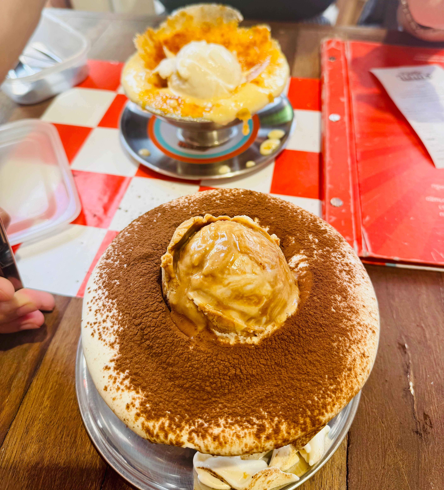

# Auntie Nid Thai Tea

This week have been a very interesting week. Andreaa and I had a chance to walk around downtown of Bangkok and yes we went to one of the famous Thai Tea in Thailand. It's the Auntie Nid Thai Tea!

    

We waited for one hour as the queue was very long. Thankfully, there were a line of chairs so customers can just sit. But the most shocking part was the price! For 1.68 SGD, it's worth the price.

    

# Dessert Hunting

We decided to explore the area near Chatuchak District because it is popular among young adults as there are dozens of cafes and restaurants there. We stumbled upon this hidden gem called **Ice Cream Somasorn** (located near Chulalongkorn University). As the title suggests, it is a dessert cafe that serves ice cream on top of a sundae. We chose the most popular one which is Banana Cream Brulee and Kopi Tiramisu.

 

