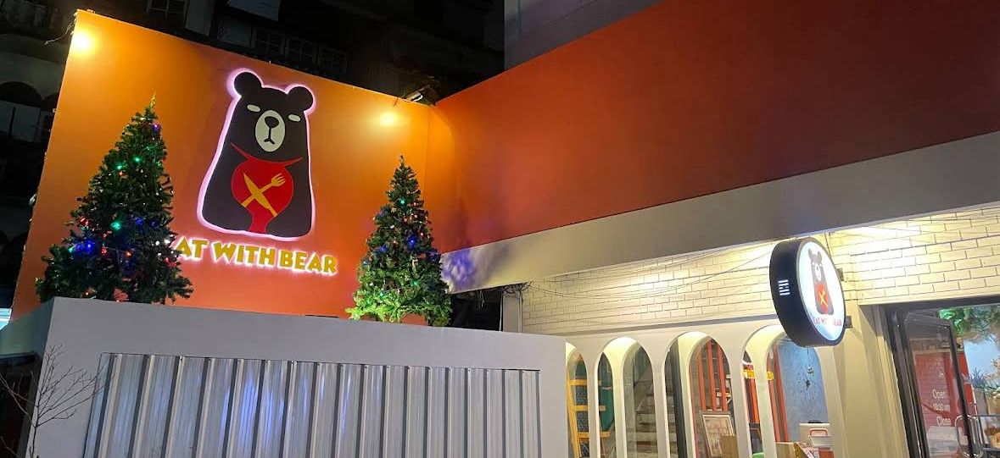

# Eat With Bear: A Western Feast at KMUTT’s Doorstep
The craving for a solid Western meal hit us hard today. While wandering near KMUTT, we were stopped in our tracks by a massive, unmissable bear mascot standing guard outside a storefront. Driven by hunger and curiosity, we decided to check it out.
 

We discovered Eat With Bear, and it was exactly what we needed. The moment we stepped inside, we were greeted by a surprisingly spacious and welcoming interior—perfect for hanging out after class.
   

But the real showstopper? The salad bar.

They offer a fantastic variety of fresh greens and toppings. And here is the best part: it’s free-flow. (Note: The unlimited salad bar is complimentary when you order specific main dishes, so check the menu first!)
 

I decided to go big and ordered the Chicken Burger. "Huge" is an understatement—this thing was a tower! It came paired with onion rings that were fried to golden perfection—crispy on the outside, tender on the inside, and completely addictive.

If you are near the university and need a burger fix, this is the spot.
Address: 368 ซอย จุฬาฯ 1 Wang Mai, Pathum Wan, Bangkok 10330

