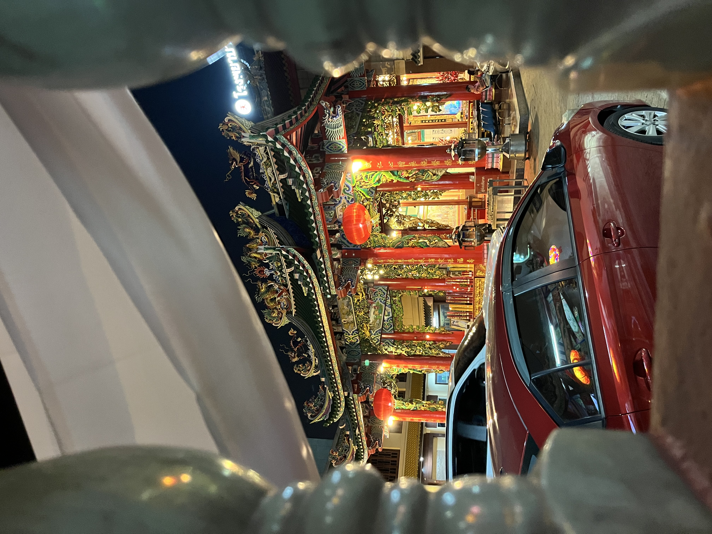
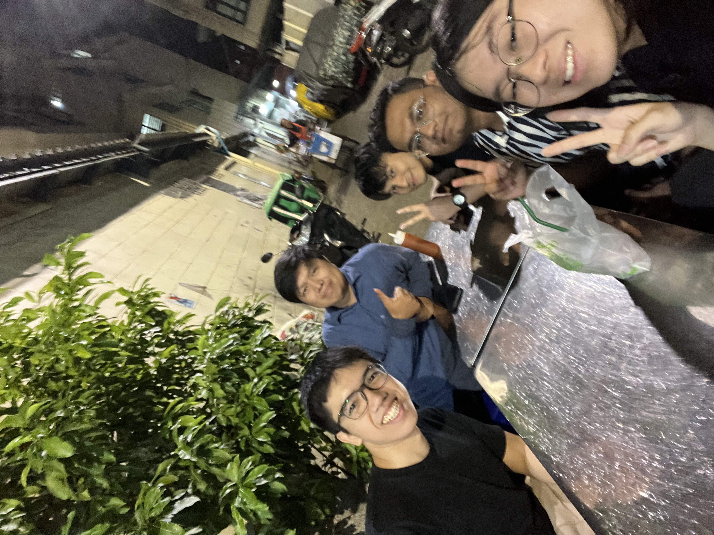
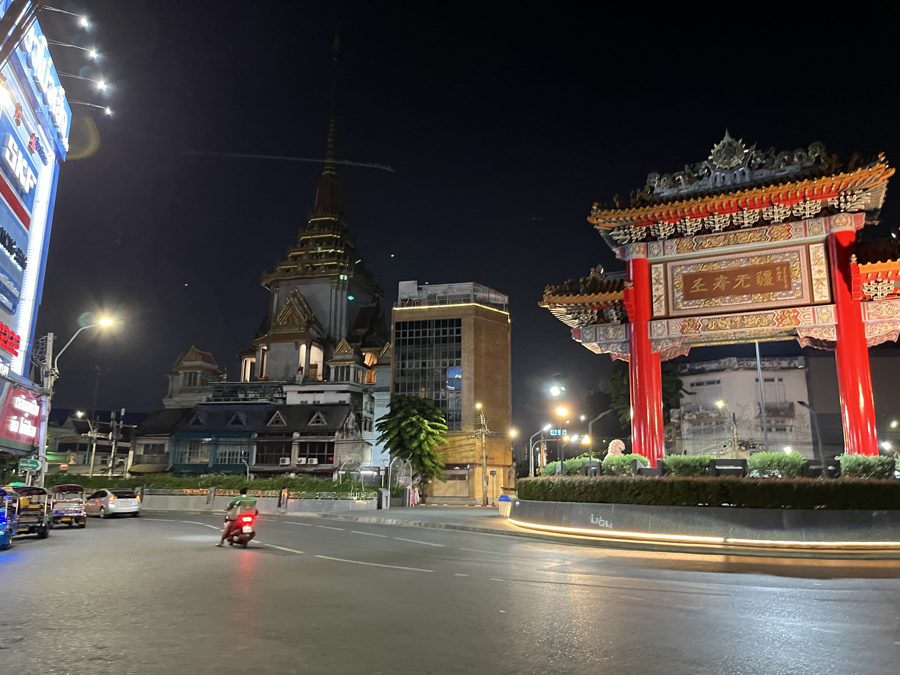
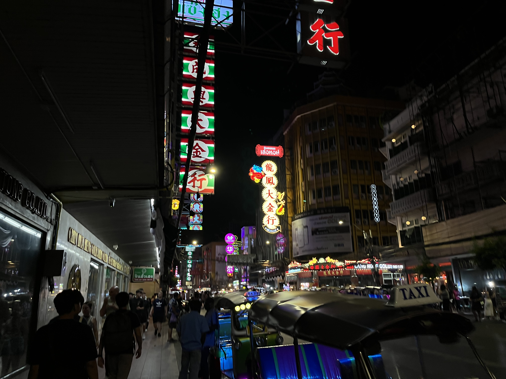

## Station 1: Chinatown~

For our first stop, we went to Chinatown after our KMITL visit (see prev. post~). After a long bus ride from our lab which took almost an hour (note: avoid Bangkok traffic on Friday..), we entered Chinatown and headed to the Kuan Yim Shrine which is Mahayana Buddhist, to offer some prayers. I sort of only did one and gave up because I was too sleepy, though KM and Khush did properly do the whole three rites.

  

Afterwards, we headed off for our well-deserved dinner; KM had a place in mind and took the scariest, most long-winded path known to man to reach it. We were joking that he would kidnap us by bringing down a weird alleyway, so when we actually started heading down one, I found myself lowkey concerned... Anyway, we ended up at a Michelin Bib Gourmand-rated restaurant (surprisingly many in Thailand btw) called Kuay Teow Kua Kai Suan Mali, which served Kuey Teow but fried into a crispy almost pancake-like dish.  

Honestly, I had pretty high expectations of the food quality as I noticed that: a), place was down a dingy alleyway, b), the menu was super tiny, and c), I mean come on its rated by Michelin. Why a) and b) though you may asK? Well, if a restaurant can look run-down yet have loads of customers then the food definitely would make up for it, and if they only make one thing, they'd better be pretty damn good at at! And indeed, it was more than above my expectations; when we order the Kuey Teow the skin was delightfully crispy and onsen eggs were absolutely perfect. In a way the fried Kuey Teow skin almost tasted like prata for some reason. Prices were very reasonable too, at 50 THB for small or 60 THB for the large, which is around 2 dollars for them. I uh, had two bowls... and would've gotten more if I didn't feel kinda unwell....

  

We wrapped up with Khush heading back himself as he lived in the area, whilst the rest of us took a bus back to our dorms to get a good night's rest and prepare for our final day of our internship, and our second last day in thailand~

## Station 2: Pratunam Market

## Station 3: This Train Service ends at -- Suvarnabhumi Airport
