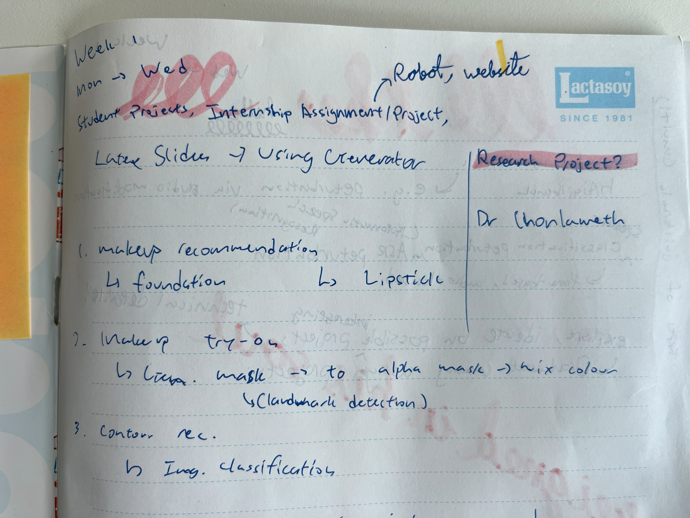
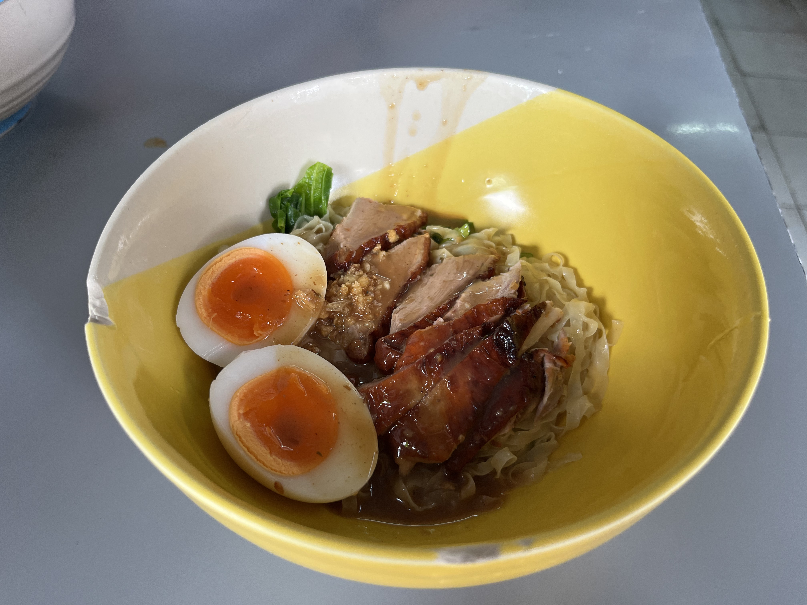

For my 3-month internship, I decided to choose one that was abroad as I wanted to learn from people with experiences that I'd never find in Singapore. Little did I know, during my first week of internship abroad in interning at King Mongkut’s University of Technology Thonburi (KMUTT) in Thailand, I'd be utterly blown away.

# Our time in BKK

 After being introduced around, I've gotten a bit more familiarised with the school's environment and the local culture. I've explored the surrounding area with my roommate and new friend Firdaus, who has been very proactive in finding new places for us. he has also been a good teammate, being very receptive to my advice and my ideas for working together on projects, and has collaborated greatly so far on brainstorming for new ideas.

So far, I've met a few people who've helped me greatly in getting integrated into the environment, like my supervisor Dr. Jonathan H. Chan,  Professor Chonlameth, and IC2 student KM. Their knowledge has been beneficial to me; for example Dr. Chonlameth helped introduce me to some student projects, while Dr. Jonathan helped give me a run down on what I'm supposed to do.

# Learning about Projects

From the students, Firdaus and I learnt about AI-related projects (which we may be assigned to), such as a makeup recommender that recommends foundation based on skin colour, and contour based on face shape -- which used YOLOv12 to classify face shapes. It also used facial segmentation image models to apply a filter (e.g. foundation, blush) in order to preview the makeup. Another project was that of an AI FAQ chatbot for the school which used RAG. in both, we learnt a bit about the tech stack used for the projects, like how certain services were containerised, and how they were used; this gave me a bit of insight into different architectures and how to set them up depending on the scope of our project.

KM covered a few of his projects (and those of other students): a time-series regression model to create synthetic data for market conditions (e.g. bull/bear conditions), a past climate change robot -- that used LLMs to spread awareness, and his current research project which is about developing a unified audio purification model/framework for (Large) Audio Language Models [(L)ALMs] to defend from attacks meant to cause a large language model (LLM) to operate in an unintended way (e.g. by bypassing guardrails). The LALM project was still in the research phase, covering research within the past few years on the topic, and how they weren't unified -- the current purification models were *only* meant to defend against attacks for one particular type of model, like a classification or speech-to-text model. They were very interesting as KM is a very technical person by nature, and the slides he presents were very detailed, covering the exact methodology and machine learning techniques used. 

KM has a deep interest in AI topics and has read up on many papers, so his deep experience with the topic makes me feel like an apprentice to a master in his craft --  I'm able to learn a lot more about the nitty gritty details of topics that I was only previously acquainted with from him. His deep understanding of the technology involved really shines through, being able to effortlessly explain complex topics in a simple and concise manner.

In general, his deep understanding of the technology involved -- gained through his interest and research into papers regarding artificial intelligence, really shines through when giving presentations; he is able to effortlessly explain complex topics in a concise and understandable manner, making him a joy to learn from and to ask questions to.

# Our work

We were told by Dr. Jonathan to brainstorm some possible ideas and solutions for our projects, and we were assigned a few things that we could work on -- for example, updating the website for the IC2 Research Center, or refining a robot that IC2 has been worked on for a previous hackathon.

For now, I have just started brainstorming and taking notes on the projects, and any new knowledge that comes my way. In the meantime, I've set up this very blog and added some features that we would need (like the Author section, which wasn't in the template).

I've also learnt a few new things about AI, like how LALMs don't actually have intermediate steps in converting audio input to text output (as opposed to first captioning the audio and passing it into the model), and even a bit about how to read candlestick graphs -- which is useful in understanding stock graphs. 

# Exploring the area

Unlike Singapore which has been forced into verticality due to its limited land area, Bangkok is held up to no such restriction. The high-rises and skyscrapers quickly disappear from my periphery as I take the bus away from the city, and it's instead replaced with shorter, less fanciful yet just-as-practical buildings -- looking similar to many Southeast Asian countries.

Besides that, me and Firdaus explored our surroundings; going to malls in the city area and finding tasty spots around the KMUTT. The path to the mall was intertwined with their rail system with a dizzying amount of verticality, with shops integrating into the rail exits integrating into mall entrances, creating  an almost cyberpunk-like feel. There was also much more life and variety in the malls; shops owned by both large chains and small businesses co-existed -- a stark contrast with Singapore's, where rent in large malls (often owned by Capitaland) are too unsustainable for small businesses, pushing them to smaller, less fancy malls at the fringe.

Not to mention, food here has been both delicious and cheap, with the meals of some days only totalling up to 140 baht (~ S$5.60) -- and that's with both drinks and dessert! 

# Message of the Week (i.e. Conclusion)

I'm grateful that I took this opportunity to leave my comfort zone and to have an internship overseas, seeing as how I've been able to learn so much and experience things that I would never have the chance to in Singapore. The enthusiasm of the people around me in their course of study and fueled my desire to strive to better myself in AI, and I hope to continue learning and working with my new-found friends.
